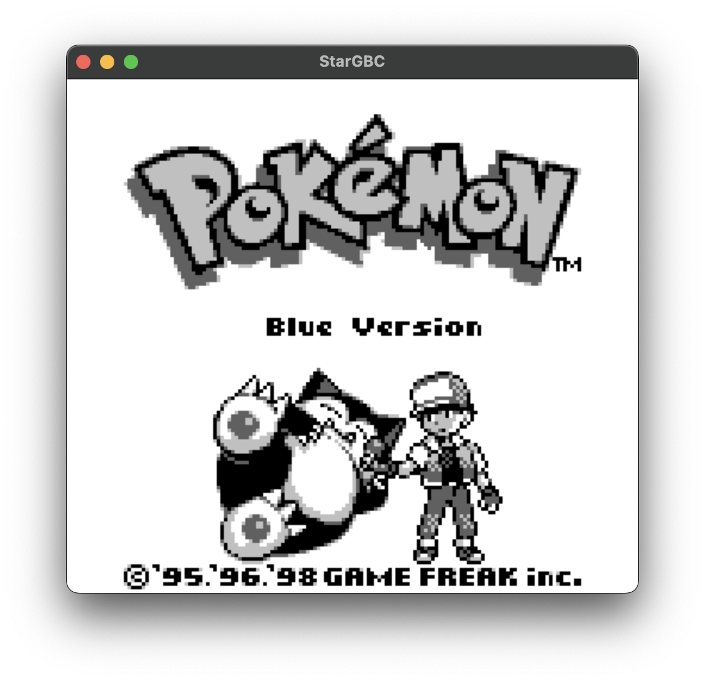
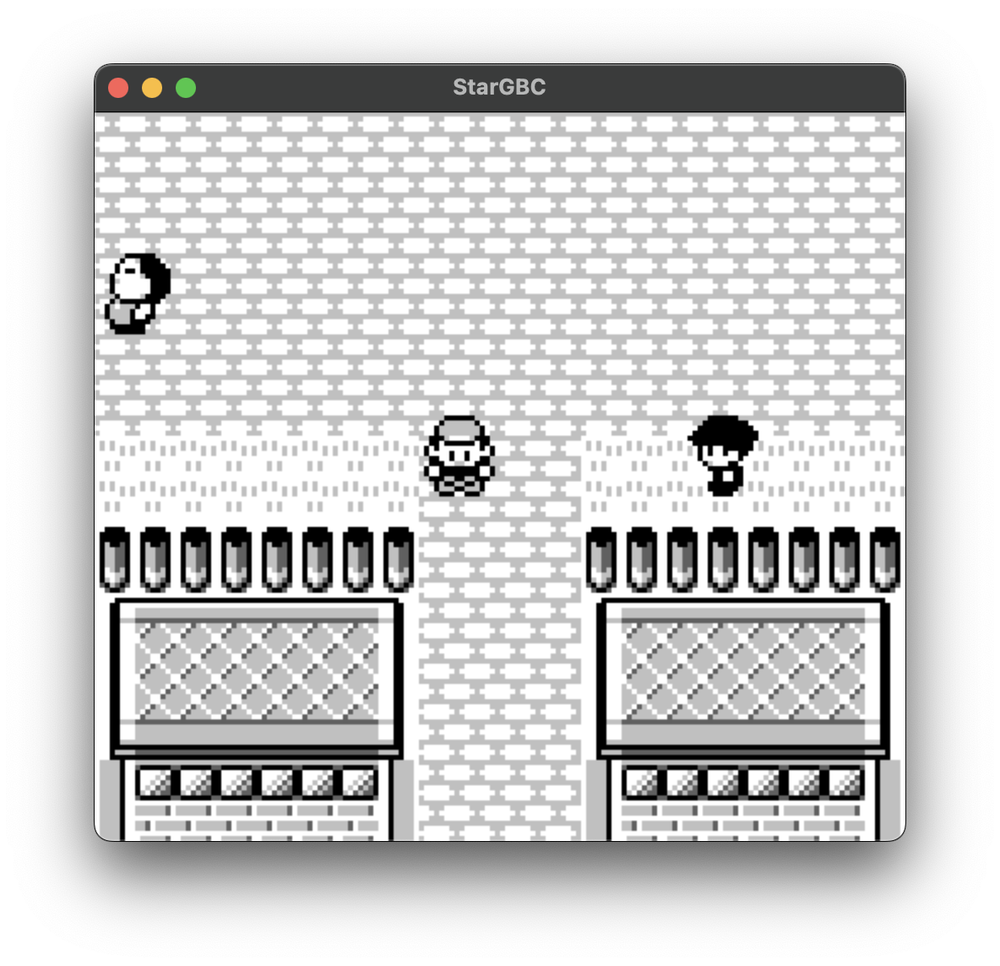
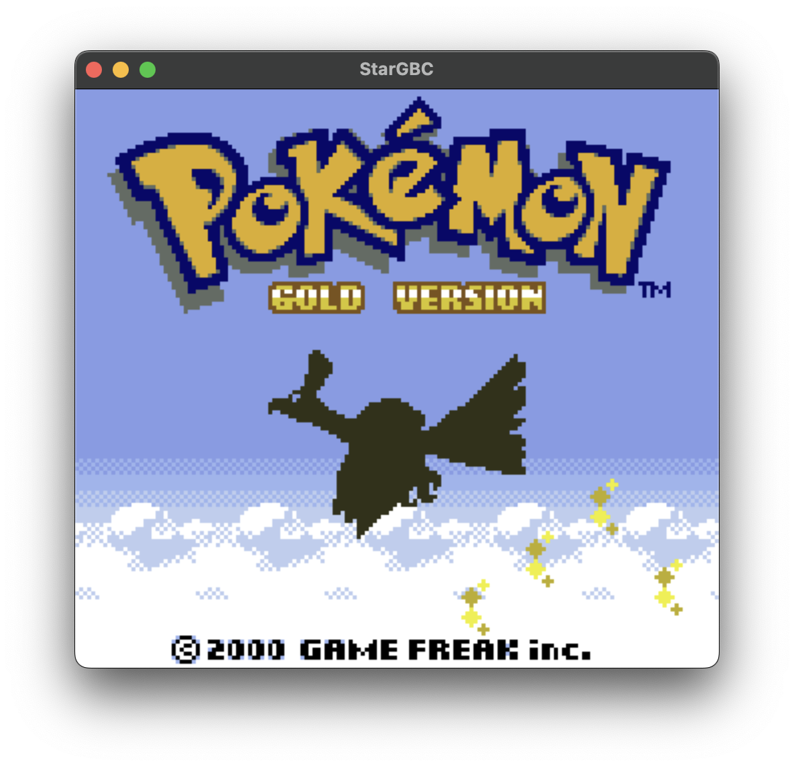
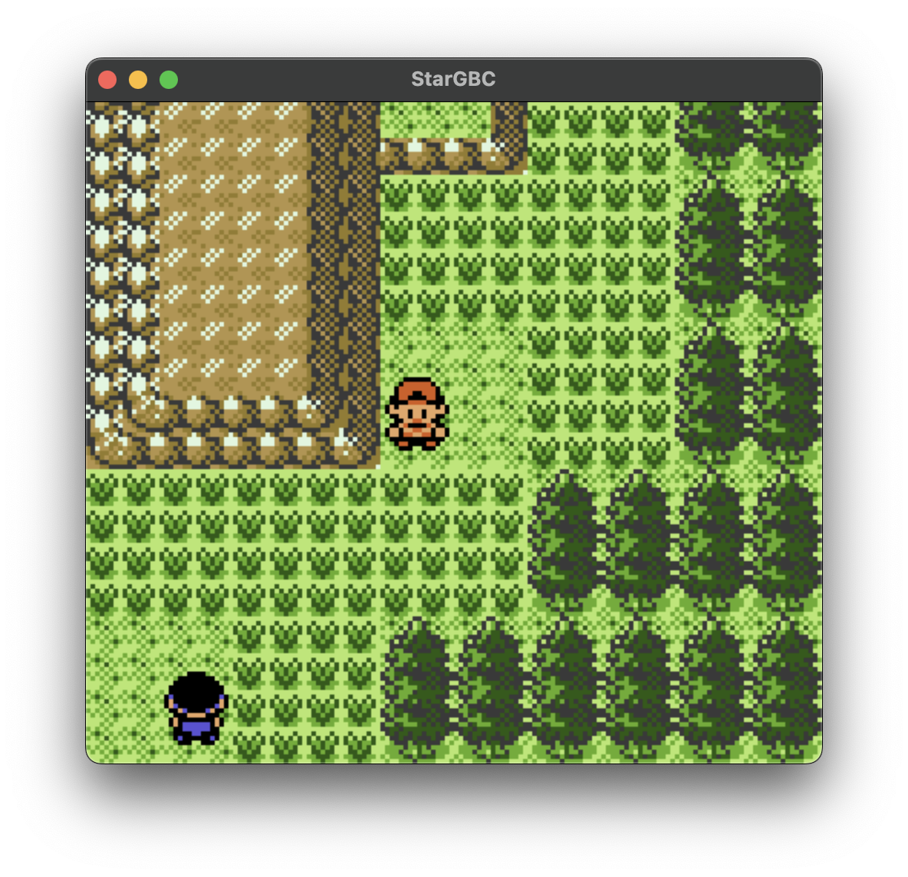
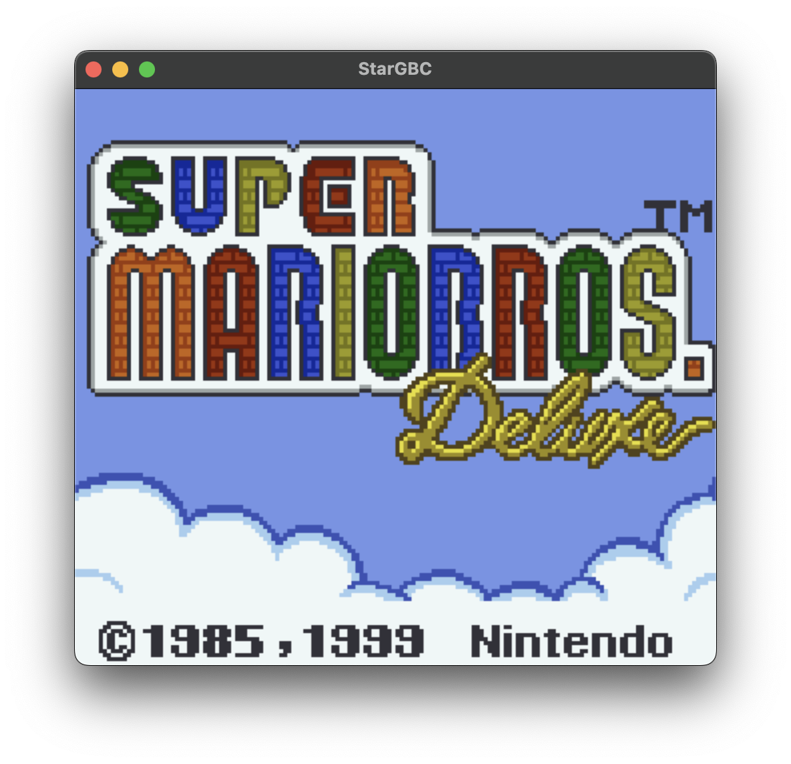
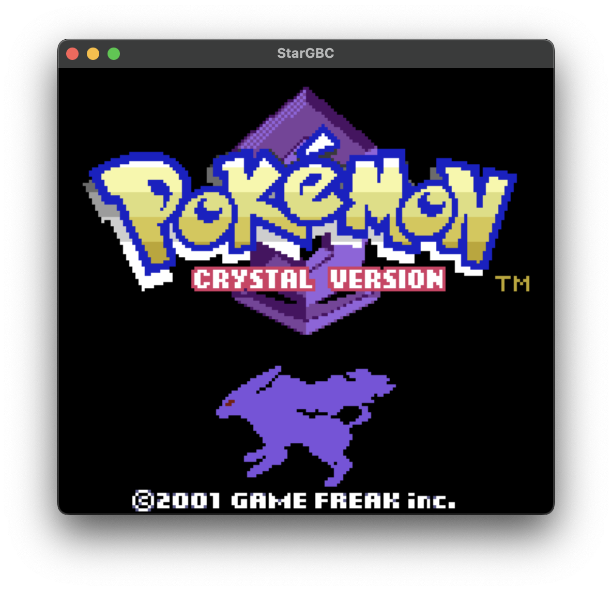

# StarGBC

<p align="center">
  
  
  
  <br/>
  
  
  
</p>

## Dependencies

1. [SDL3](https://github.com/libsdl-org/SDL)
2. [doctest](https://github.com/doctest/doctest)
3. [Ninja](https://github.com/ninja-build/ninja)

## Building

1. Clone the repository:
   ```bash
   git clone https://github.com/srikur/StarGBC.git
2. Update submodules:
   ```bash
   git submodule update --init --recursive
   ```
3. Configure CMake:
   ```bash
   cmake -DCMAKE_MAKE_PROGRAM=/path/to/ninja -G Ninja -DBUILD_SHARED_LIBS=false -S . -B build
   ```
4. Build the project:
   ```bash
   cmake --build build
   ```

## Test ROM Performance

### Blargg's tests

| Test                                  | StarGBC            |
|---------------------------------------|--------------------|
| cpu_instrs/01-special.gb              | :white_check_mark: |
| cpu_instrs/02-interrupts.gb           | :white_check_mark: |
| cpu_instrs/03-op sp,hl.gb             | :white_check_mark: |
| cpu_instrs/04-op r,imm.gb             | :white_check_mark: |
| cpu_instrs/05-op rp.gb                | :white_check_mark: |
| cpu_instrs/06-ld r,r.gb               | :white_check_mark: |
| cpu_instrs/07-jr,jp,call,ret,rst.gb   | :white_check_mark: |
| cpu_instrs/08-misc instrs.gb          | :white_check_mark: |
| cpu_instrs/09-op r,r.gb               | :white_check_mark: |
| cpu_instrs/10-bit ops.gb              | :white_check_mark: |
| cpu_instrs/11-op a,(hl).gb            | :white_check_mark: |
| instr_timing.gb                       | :white_check_mark: |
| mem_timing/01-read_timing.gb          | :white_check_mark: |
| mem_timing/02-write_timing.gb         | :white_check_mark: |
| mem_timing/03-modify_timing.gb        | :white_check_mark: |
| mem_timing-2/01-read_timing.gb        | :white_check_mark: |
| mem_timing-2/02-write_timing.gb       | :white_check_mark: |
| mem_timing-2/03-modify_timing.gb      | :white_check_mark: |
| interrupt_time                        | :x:                |
| halt_bug                              | :white_check_mark: |
| dmg_sound/01-registers.gb             | :x:                |
| dmg_sound/02-len ctr.gb               | :x:                |
| dmg_sound/03-trigger.gb               | :x:                |
| dmg_sound/04-sweep.gb                 | :x:                |
| dmg_sound/05-sweep details.gb         | :x:                |
| dmg_sound/06-overflow on trigger.gb   | :x:                |
| dmg_sound/07-len sweep period sync.gb | :x:                |
| dmg_sound/08-len ctr during power.gb  | :x:                |
| dmg_sound/09-wave read while on.gb    | :x:                |
| dmg_sound/10-wave trigger while on.gb | :x:                |
| dmg_sound/11-regs after power.gb      | :x:                |
| dmg_sound/12-wave write while on.gb   | :x:                |
| cgb_sound/01-registers.gb             | :x:                |
| cgb_sound/02-len ctr.gb               | :x:                |
| cgb_sound/03-trigger.gb               | :x:                |
| cgb_sound/04-sweep.gb                 | :x:                |
| cgb_sound/05-sweep details.gb         | :x:                |
| cgb_sound/06-overflow on trigger.gb   | :x:                |
| cgb_sound/07-len sweep period sync.gb | :x:                |
| cgb_sound/08-len ctr during power.gb  | :x:                |
| cgb_sound/09-wave read while on.gb    | :x:                |
| cgb_sound/10-wave trigger while on.gb | :x:                |
| cgb_sound/11-regs after power.gb      | :x:                |
| cgb_sound/12-wave.gb                  | :x:                |
| oam_bug/1-lcd_sync                    | :x:                |
| oam_bug/2-causes                      | :x:                |
| oam_bug/3-non_causes                  | :white_check_mark: |
| oam_bug/4-scanline_timing             | :x:                |
| oam_bug/5-timing_bug                  | :x:                |
| oam_bug/6-timing_no_bug               | :white_check_mark: |
| oam_bug/7-timing_effect               | :x:                |
| oam_bug/8-instr_effect                | :x:                |

### Mooneye GB Tests

| Timer                                    | StarGBC            |
|------------------------------------------|--------------------|
| acceptance/timer/div_write.gb            | :white_check_mark: |
| acceptance/timer/rapid_toggle.gb         | :white_check_mark: |
| acceptance/timer/tim00.gb                | :white_check_mark: |
| acceptance/timer/tim00_div_trigger.gb    | :white_check_mark: |
| acceptance/timer/tim01.gb                | :white_check_mark: |
| acceptance/timer/tim01_div_trigger.gb    | :white_check_mark: |
| acceptance/timer/tim10.gb                | :white_check_mark: |
| acceptance/timer/tim10_div_trigger.gb    | :white_check_mark: |
| acceptance/timer/tim11.gb                | :white_check_mark: |
| acceptance/timer/tim11_div_trigger.gb    | :white_check_mark: |
| acceptance/timer/tima_reload.gb          | :white_check_mark: |
| acceptance/timer/tima_write_reloading.gb | :white_check_mark: |
| acceptance/timer/tma_write_reloading.gb  | :white_check_mark: |

| General                               | StarGBC            |
|---------------------------------------|--------------------|
| acceptance/add_sp_e_timing.gb         | :white_check_mark: |
| acceptance/boot_div-dmg0.gb           | :x:                |
| acceptance/boot_div-dmgABCmgb.gb      | :x:                |
| acceptance/boot_div-S.gb              | :x:                |
| acceptance/boot_div2-s.gb             | :x:                |
| acceptance/boot_hwio-dmg0.gb          | :x:                |
| acceptance/boot_hwio-dmgABCmgb.gb     | :x:                |
| acceptance/boot_hwio-S.gb             | :x:                |
| acceptance/boot_regs-dmg0.gb          | :white_check_mark: |
| acceptance/boot_regs-dmgABC.gb        | :white_check_mark: |
| acceptance/boot_regs-mgb.gb           | :white_check_mark: |
| acceptance/boot_regs-sgb.gb           | :white_check_mark: |
| acceptance/boot_regs-sgb2.gb          | :white_check_mark: |
| acceptance/call_cc_timing.gb          | :white_check_mark: |
| acceptance/call_cc_timing2.gb         | :white_check_mark: |
| acceptance/call_timing.gb             | :white_check_mark: |
| acceptance/call_timing2.gb            | :white_check_mark: |
| acceptance/di_timing-GS.gb            | :white_check_mark: |
| acceptance/div_timing.gb              | :white_check_mark: |
| acceptance/ei_sequence.gb             | :white_check_mark: |
| acceptance/ei_timing.gb               | :white_check_mark: |
| acceptance/halt_ime0_ei.gb            | :white_check_mark: |
| acceptance/halt_ime0_nointr_timing.gb | :x:                |
| acceptance/halt_ime1_timing.gb        | :white_check_mark: |
| acceptance/halt_ime1_timing2-GS.gb    | :white_check_mark: |
| acceptance/if_ie_registers.gb         | :white_check_mark: |
| acceptance/intr_timing.gb             | :white_check_mark: |
| acceptance/jp_cc_timing.gb            | :white_check_mark: |
| acceptance/jp_timing.gb               | :white_check_mark: |
| acceptance/ld_hl_sp_e_timing.gb       | :white_check_mark: |
| acceptance/oam_dma_restart.gb         | :white_check_mark: |
| acceptance/oma_dma_start.gb           | :white_check_mark: |
| acceptance/oam_dma_timing.gb          | :white_check_mark: |
| acceptance/pop_timing.gb              | :white_check_mark: |
| acceptance/push_timing.gb             | :white_check_mark: |
| acceptance/rapid_di_ei.gb             | :white_check_mark: |
| acceptance/ret_cc_timing.gb           | :white_check_mark: |
| acceptance/ret_timing.gb              | :white_check_mark: |
| acceptance/reti_intr_timing.gb        | :white_check_mark: |
| acceptance/reti_timing.gb             | :white_check_mark: |
| acceptance/rst_timing.gb              | :white_check_mark: |

| Serial                                         | StarGBC |
|------------------------------------------------|---------|
| acceptance/serial/boot_sclk_align-dmgABCmgb.gb | :x:     |

| PPU                                           | StarGBC            |
|-----------------------------------------------|--------------------|
| acceptance/ppu/hblank_ly_scx_timing-GS.gb     | :x:                |
| acceptance/ppu/intr_1_2_timing-GS.gb          | :white_check_mark: |
| acceptance/ppu/intr_2_0_timing.gb             | :white_check_mark: |
| acceptance/ppu/intr_2_mode0_timing_sprites.gb | :x:                |
| acceptance/ppu/intr_2_mode0_timing.gb         | :white_check_mark: |
| acceptance/ppu/intr_2_mode3_timing.gb         | :white_check_mark: |
| acceptance/ppu/intr_2_oam_ok_timing.gb        | :x:                |
| acceptance/ppu/lcdon_timing-GS.gb             | :x:                |
| acceptance/ppu/lcdon_write_timing-GS.gb       | :x:                |
| acceptance/ppu/stat_irq_blocking.gb           | :x:                |
| acceptance/ppu/stat_lyc_onoff.gb              | :x:                |
| acceptance/ppu/vblank_stat_intr-GS.gb         | :x:                |

| oam_dma                          | StarGBC            |
|----------------------------------|--------------------|
| acceptance/oam_dma/basic.gb      | :white_check_mark: |
| acceptance/oam_dma/reg_read.gb   | :white_check_mark: |
| acceptance/oam_dma/sources-GS.gb | :x:                |

| interrupts                       | StarGBC |
|----------------------------------|---------|
| acceptance/interrupts/ie_push.gb | :x:     |

| instr                        | StarGBC            |
|------------------------------|--------------------|
| acceptance/interrupts/daa.gb | :white_check_mark: |

| bits                                    | StarGBC            |
|-----------------------------------------|--------------------|
| acceptance/interrupts/mem_oam.gb        | :white_check_mark: |
| acceptance/interrupts/reg_f.gb          | :white_check_mark: |
| acceptance/interrupts/unused_hwio-GS.gb | :x:                |

