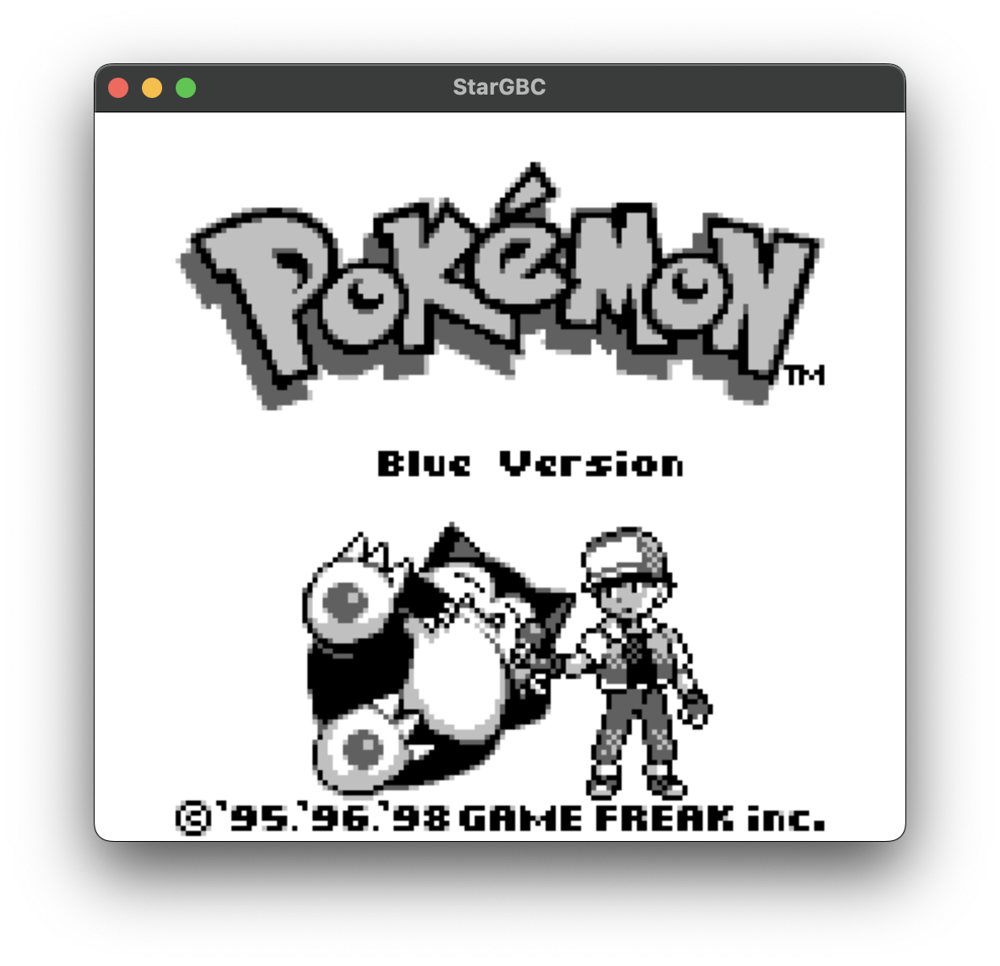
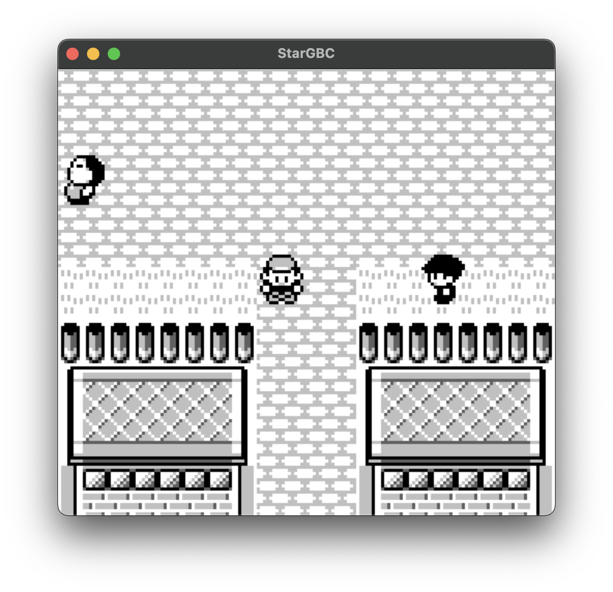
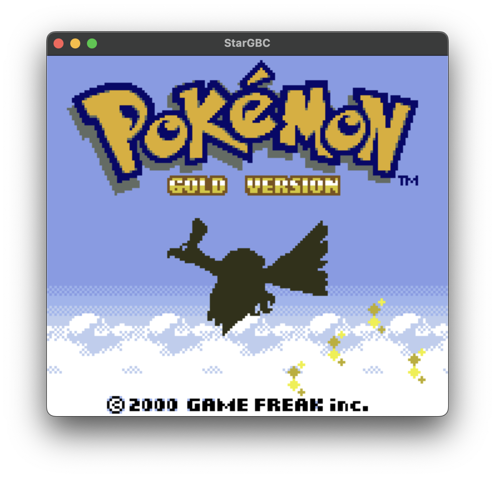
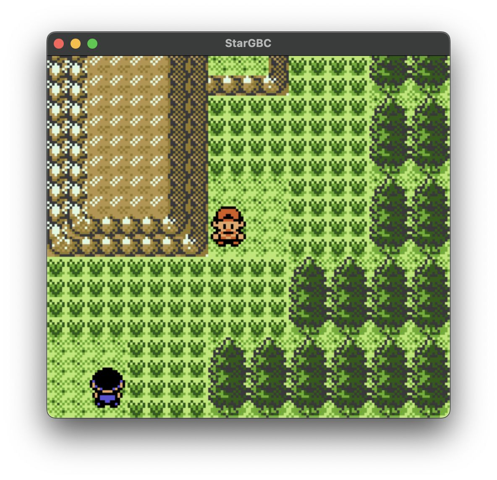
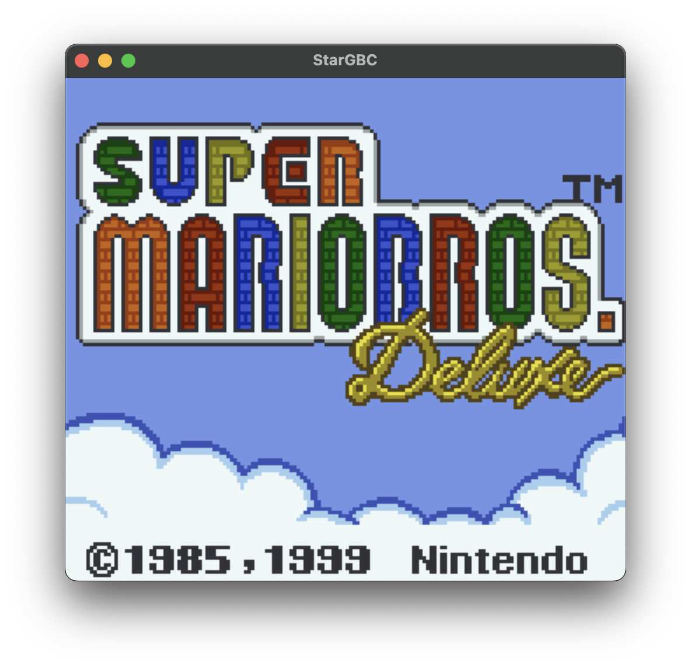
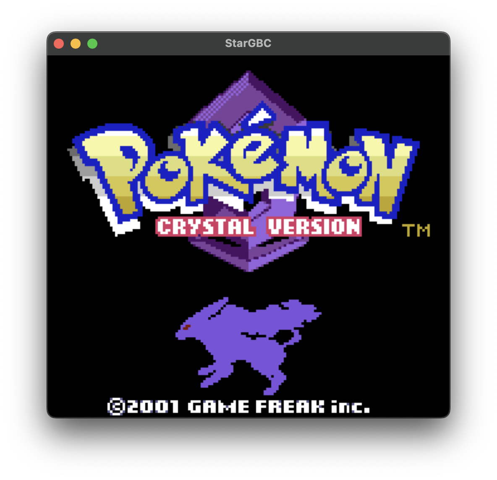

# StarGBC

<p align="center">
  
  
  
  <br/>
  
  
  
</p>

## Dependencies

1. [SDL3](https://github.com/libsdl-org/SDL)
2. [doctest](https://github.com/doctest/doctest)
3. [Ninja](https://github.com/ninja-build/ninja)
4. [spdlog](https://github.com/gabime/spdlog)
5. [starparse](https://github.com/srikur/starparse)

All library dependencies are downloaded and built automatically at configure
time via CMake's FetchContent. Only CMake 4+ and Ninja need to be installed.

## Building

1. Clone the repository:
   ```bash
   git clone https://github.com/srikur/StarGBC.git
   ```
2. Configure and build:
   ```bash
   cmake --workflow --preset release
   ```

## Hardware models

Select a silicon revision with `--model`, for example:

```bash
build/release/Release/StarGBC --model cgbb --bios roms/cgb_boot.bin game.gbc
build/release/Release/StarGBC --model cgbe game.gb
```

The physical model stays fixed when a Color or Advance runs a monochrome
cartridge. `auto` selects DMG-B for monochrome cartridges and CGB-E for Color
cartridges. The aliases `dmg`, `cgb`, `agb`, and `ags` select DMG-B, CGB-E,
AGB-A, and AGB-B respectively.
